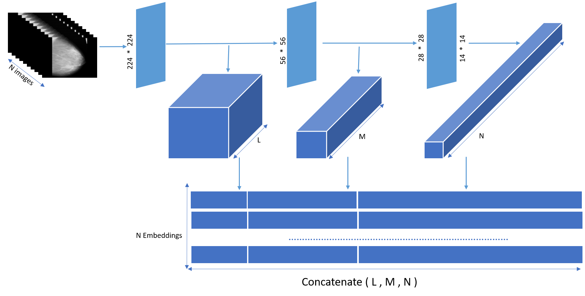
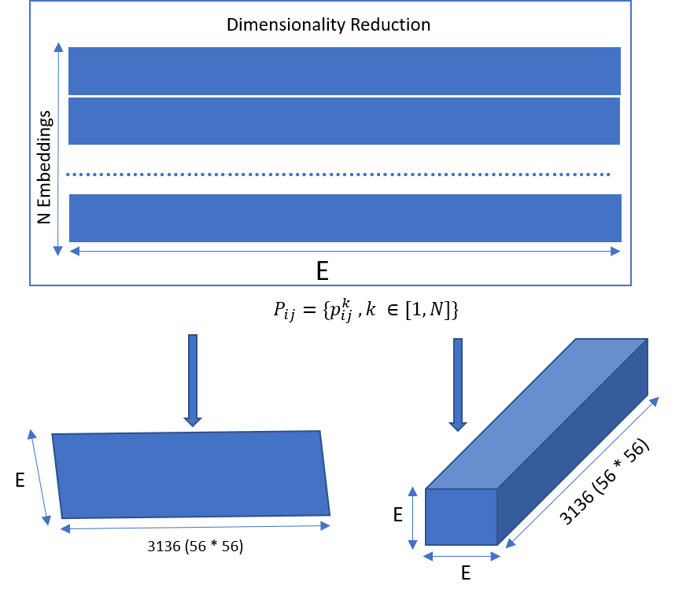
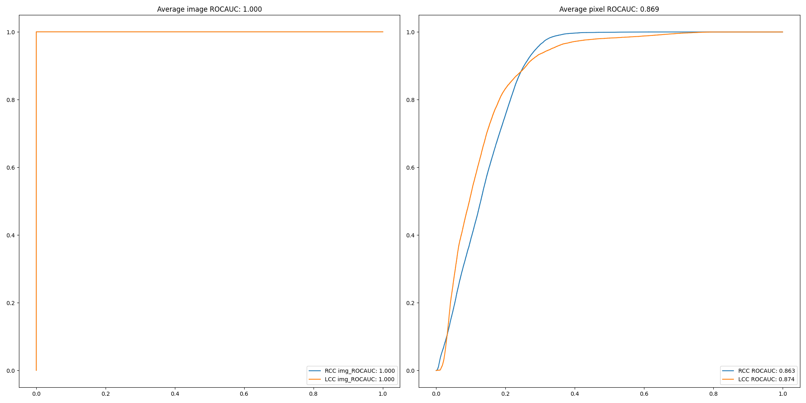

# Abnormality-Detection-in-Digital-Breast-Mammography

Code repository of the paper titled, "Abnormality Detection in Digital Breast Mammography Images using deep learning techniques".
This code is borrowed from (https://github.com/byungjae89/SPADE-pytorch) and (https://github.com/byungjae89/MahalanobisAD-pytorch)
### Datasets 
MIAS Mammography : Download from [Kaggle](https://www.kaggle.com/kmader/mias-mammography)

### Requirements
Python 3.6 or later with all requirements.txt dependencies installed, including torch>=1.7. To install run:
```
 pip install -r requirement.txt
```
### Architecture

<p align ="center">

<p align ="center">

### Evaluation

</p>
